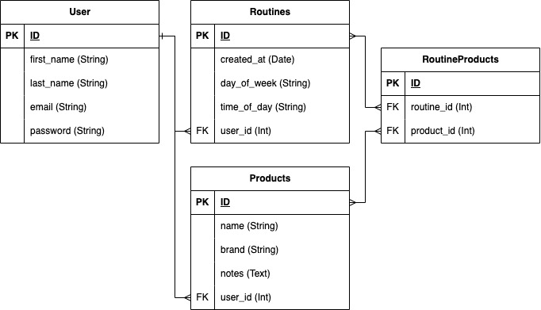

# Skin Stack (API Webserver)

Skin Stack is a to-the-point, no frills Skincare Routine Tracker that helps users track their skincare products and daily routines, taking the guesswork out of their beauty regime.

## Links

- Github Repository
- [Development Plan (Linear)](https://linear.app/kats-workspace/join/88596d7e69b639b4a651783417b35e23?s=4)

# Table of Contents

- [Purpose and Overview](#📖-purpose-and-overview)
- [API Endpoints](#☁️-api-endpoints)
- [ERD Overview](#📚-erd-overview)
- [Project Models & Database Relations](#🧱-project-models--database-relations)
- [Database Management & ORM](#👨‍💼-database-management--orm)
- [Development Plan](#💻-development-plan)

## 📖 Purpose and Overview

Millions of people globally have some kind of skincare routine; this can range from a simple daily moisturiser to a complex 10 step regime. But as a skincare routine grows, so too does the number of products you have, and the number of interactions between products that need to be considered. Some products need to be used at night time, others in the morning, some need to be washed of immediately, others kept on, some can't be used in conjunction with certain other products and others need to be used only twice a week. How do you keep track of it all?

As someone that's recently embarked on a skincare journey I've felt this pain first hand. It's become increasingly challenging to keep track of which products I should be using, when I should be using them and what order I should be using them in. I've been on the hunt for solutions to help me track my routines but every application I tried is either too costly, has a lot of extra's around mood or food tracking and other aspects I'm not interested in or has poor UI making it frustrating to navigate. It's seemed impossible to find a simple, no-fluff skincare routine tracker that let's me add products in a click and tracks the what, how and when of my daily skincare routines.

And when speaking to people around me, it seems I'm not alone. Many have resorted to just using the notes app in their phone in lieu of a better solution. And as you can imagine it quickly becomes frustrating to manually add and change products or routines across all days of the week, not to mention the lack of product tracking or home screen reminders.

This is where Skin Stack comes in - an intuitive no-frills way to track and maintain your skincare routines without the effort.

## ☁️ API Endpoints

### Key User Actions

**User**

- A user can Register (Create an account)
- A user can Login to an existing account

**Products**

- A user can add a new product (scoped to the user)
- A user can get a list of all their added products
- A user can update one of their existing products
- A user can delete one of their products

**Routines**

- A user can create a new routine for themselves
- A user can add a product to an existing routine
- A user can delete a product from an existing routine
- A user can get a list of all their routines and the products within them
- A user can delete a routine of theirs (this will not delete the products themselves, as products can exist without being associated with a routine)

## 📚 ERD Overview

### Key points:

- A user can have many routines
- A user can add many products
- Products can be added and not necessarily be in a routine
- Routines can technically be empty
- The workflow: empty routines are created and then products are later added to them
- Either new or existing products can be added to routines
  - (Will check if product exists first and if not, create a new one)
- Routines and products are scoped to a user, so they have full control over everything (Create, update, delete, get). There is no shared database across all users

## 🧱 Project Models & Database Relations

## 👨‍💼 Database Management & ORM

### Database Management

PostgreSQL was chosen as it is a powerful relational database management system. For my project this is an important factor given the many-to-many relationship between Routines and Products (described in the ERD above). Additionally PostgreSQL offered more scalability and extensibility than other options (such as MySQL), as well as having robust data integrity functionality, making future project enhancements and expansions possible with ease.

However it's worth noting that these advantages do come with the trade off of performance. PostgreSQL being so highly exstensible comes at a cost, and as such it's not as lightweight as some of it's competitors. Taking thsi into consideration, having concurrency handled extremely well and certainty about the integrity of my data was worth the trade off.

### ORM

## 💻 Development Plan
